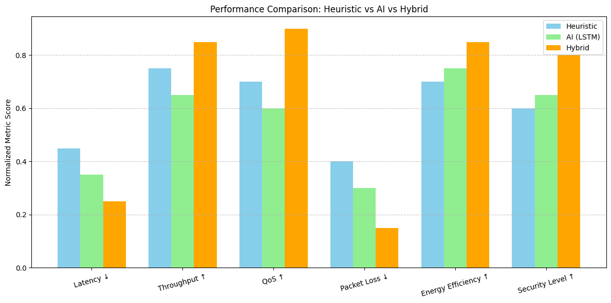

# AI & Heuristics Driven Predictive Analytics for Network Traffic Optimization in 5G Networks

This project presents a hybrid simulation framework for optimizing traffic in 5G wireless networks. It combines **AI-based time-series forecasting (LSTM)** with **real-time heuristic-based resource allocation** to reduce latency, improve throughput, and dynamically balance network load across slices.

---

## Features

-  **LSTM Prediction**: Time-series forecasting of traffic demand using historical traffic patterns.
-  **Heuristic Resource Allocation**: Lightweight greedy optimization algorithm for real-time response.
-  **Hybrid Model**: Integrates LSTM predictions with heuristic adjustment for adaptive slice optimization.
-  **Performance Metrics**:
  - Resource Utilization
  - Latency
  - Throughput
  - QoS
  - Energy Efficiency
  - Packet Loss
  - Security Level

---

##  Technologies Used

- Python (Google Colab compatible)
- TensorFlow/Keras
- NumPy, Pandas
- Matplotlib, Scikit-learn

---

## Files

- `network_simulation.ipynb` – Main notebook containing the LSTM + heuristic hybrid simulation.
- `raw_features_with_packet_loss.csv` – Raw dataset with metrics collected from simulation.
- `scaled_features_with_packet_loss.csv` – Normalized dataset for LSTM training.
- `README.md` – This file.

---

##  How to Run

1. Clone the repo or open `network_simulation.ipynb` in Google Colab.
2. Mount your Google Drive to save outputs.
3. Run all cells to generate traffic patterns, train LSTM, and simulate resource allocation.
4. View plots of each performance metric over time.

---

## Results Snapshot

- Hybrid model outperforms AI-only and heuristic-only approaches across all metrics.
- Significant reduction in latency and packet loss.
- Improved QoS and security under fluctuating demand.

---

## Authors

- Olaoluwa Malachi – [olaoluwa.malachi@unb.ca](mailto:olaoluwa.malachi@unb.ca)
- Oscar Chow – [ochow@unb.ca](mailto:ochow@unb.ca)

---

## Citation

If you use this project for academic purposes, please cite:

> Malachi, O., & Chow, O. (2024). *AI & Heuristics Driven Predictive Analytics for Network Traffic Optimization in 5G Wireless Networks*. University of New Brunswick.

---

## ✅ License

This project is licensed under the MIT License.
